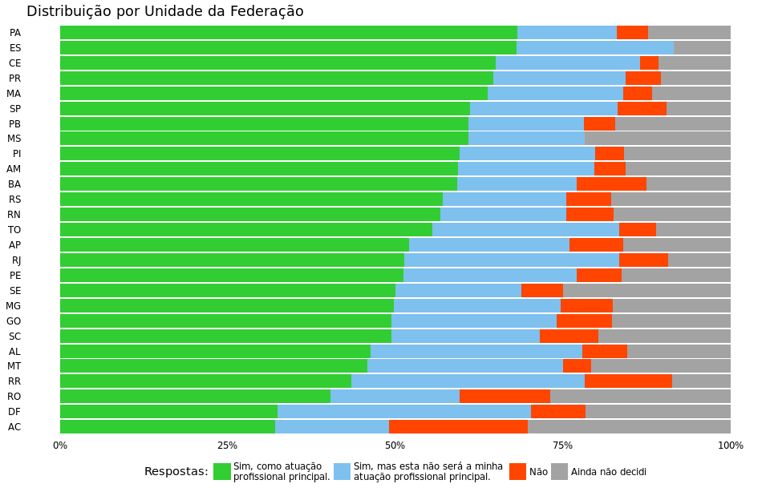
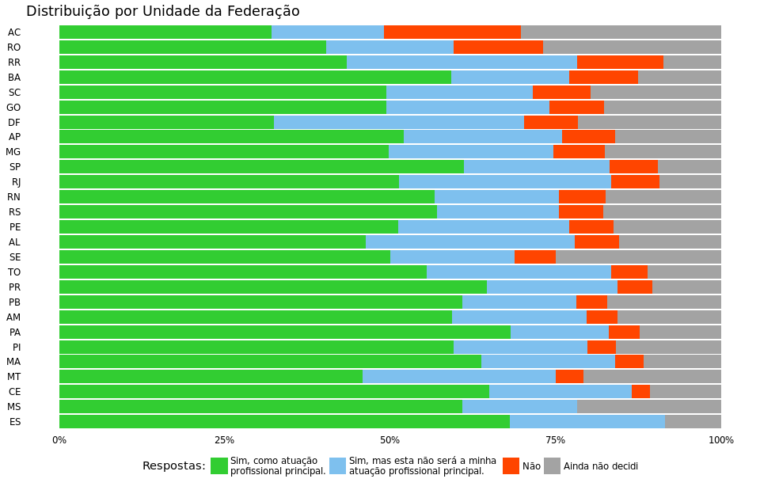
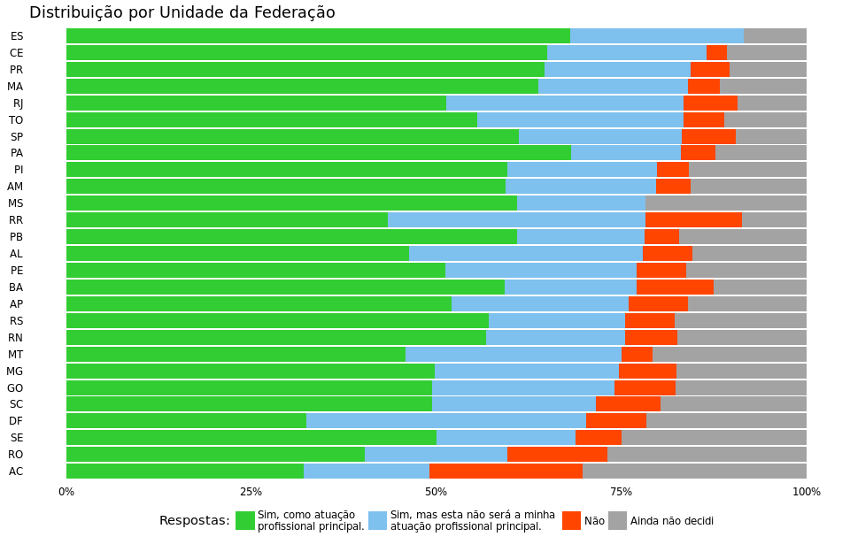

Gráficos de distribuição por estado
================

> Gerei três gráficos com diferentes organizações para que pudessemos escolher. Veja também as cores, se houver alguma alteração nas cores seria interesse recomendar, pois todos os gráficos seguirão o mesmo padão.

Organizado pela resposta *(a) Sim, como atuação principal.*
-----------------------------------------------------------

<!-- -->

Organizado pela resposta *(c) Não.*
-----------------------------------

<!-- -->

Organizado pela resposta *(a) Sim, como atuação principal.* + (b) *Sim, mas esta não será minha profissão principal.*
---------------------------------------------------------------------------------------------------------------------

<!-- -->

Tabela organizada por UF
------------------------

<table>
<colgroup>
<col width="26%" />
<col width="28%" />
<col width="11%" />
<col width="11%" />
<col width="11%" />
<col width="11%" />
</colgroup>
<thead>
<tr class="header">
<th align="center">  
Unidade da Federação</th>
<th align="center">interesse em exercer o magistério 
a</th>
<th align="center">  
b</th>
<th align="center">  
c</th>
<th align="center">  
d</th>
<th align="center">  
Total</th>
</tr>
</thead>
<tbody>
<tr class="odd">
<td align="center"><strong>AC</strong> 
N 
Row(%)</td>
<td align="center">  
17 
32.1%</td>
<td align="center">  
9 
17.0%</td>
<td align="center">  
11 
20.8%</td>
<td align="center">  
16 
30.2%</td>
<td align="center">  
53 
1.8%</td>
</tr>
<tr class="even">
<td align="center"><strong>AL</strong> 
N 
Row(%)</td>
<td align="center">  
63 
46.3%</td>
<td align="center">  
43 
31.6%</td>
<td align="center">  
9 
6.6%</td>
<td align="center">  
21 
15.4%</td>
<td align="center">  
136 
4.7%</td>
</tr>
<tr class="odd">
<td align="center"><strong>AM</strong> 
N 
Row(%)</td>
<td align="center">  
38 
59.4%</td>
<td align="center">  
13 
20.3%</td>
<td align="center">  
3 
4.7%</td>
<td align="center">  
10 
15.6%</td>
<td align="center">  
64 
2.2%</td>
</tr>
<tr class="even">
<td align="center"><strong>AP</strong> 
N 
Row(%)</td>
<td align="center">  
13 
52.0%</td>
<td align="center">  
6 
24.0%</td>
<td align="center">  
2 
8.0%</td>
<td align="center">  
4 
16.0%</td>
<td align="center">  
25 
0.9%</td>
</tr>
<tr class="odd">
<td align="center"><strong>BA</strong> 
N 
Row(%)</td>
<td align="center">  
80 
59.3%</td>
<td align="center">  
24 
17.8%</td>
<td align="center">  
14 
10.4%</td>
<td align="center">  
17 
12.6%</td>
<td align="center">  
135 
4.7%</td>
</tr>
<tr class="even">
<td align="center"><strong>CE</strong> 
N 
Row(%)</td>
<td align="center">  
139 
65.0%</td>
<td align="center">  
46 
21.5%</td>
<td align="center">  
6 
2.8%</td>
<td align="center">  
23 
10.7%</td>
<td align="center">  
214 
7.4%</td>
</tr>
<tr class="odd">
<td align="center"><strong>DF</strong> 
N 
Row(%)</td>
<td align="center">  
12 
32.4%</td>
<td align="center">  
14 
37.8%</td>
<td align="center">  
3 
8.1%</td>
<td align="center">  
8 
21.6%</td>
<td align="center">  
37 
1.3%</td>
</tr>
<tr class="even">
<td align="center"><strong>ES</strong> 
N 
Row(%)</td>
<td align="center">  
32 
68.1%</td>
<td align="center">  
11 
23.4%</td>
<td align="center">  
0 
0.0%</td>
<td align="center">  
4 
8.5%</td>
<td align="center">  
47 
1.6%</td>
</tr>
<tr class="odd">
<td align="center"><strong>GO</strong> 
N 
Row(%)</td>
<td align="center">  
42 
49.4%</td>
<td align="center">  
21 
24.7%</td>
<td align="center">  
7 
8.2%</td>
<td align="center">  
15 
17.6%</td>
<td align="center">  
85 
2.9%</td>
</tr>
<tr class="even">
<td align="center"><strong>MA</strong> 
N 
Row(%)</td>
<td align="center">  
60 
63.8%</td>
<td align="center">  
19 
20.2%</td>
<td align="center">  
4 
4.3%</td>
<td align="center">  
11 
11.7%</td>
<td align="center">  
94 
3.3%</td>
</tr>
<tr class="odd">
<td align="center"><strong>MG</strong> 
N 
Row(%)</td>
<td align="center">  
128 
49.8%</td>
<td align="center">  
64 
24.9%</td>
<td align="center">  
20 
7.8%</td>
<td align="center">  
45 
17.5%</td>
<td align="center">  
257 
8.9%</td>
</tr>
<tr class="even">
<td align="center"><strong>MS</strong> 
N 
Row(%)</td>
<td align="center">  
14 
60.9%</td>
<td align="center">  
4 
17.4%</td>
<td align="center">  
0 
0.0%</td>
<td align="center">  
5 
21.7%</td>
<td align="center">  
23 
0.8%</td>
</tr>
<tr class="odd">
<td align="center"><strong>MT</strong> 
N 
Row(%)</td>
<td align="center">  
11 
45.8%</td>
<td align="center">  
7 
29.2%</td>
<td align="center">  
1 
4.2%</td>
<td align="center">  
5 
20.8%</td>
<td align="center">  
24 
0.8%</td>
</tr>
<tr class="even">
<td align="center"><strong>PA</strong> 
N 
Row(%)</td>
<td align="center">  
133 
68.2%</td>
<td align="center">  
29 
14.9%</td>
<td align="center">  
9 
4.6%</td>
<td align="center">  
24 
12.3%</td>
<td align="center">  
195 
6.8%</td>
</tr>
<tr class="odd">
<td align="center"><strong>PB</strong> 
N 
Row(%)</td>
<td align="center">  
39 
60.9%</td>
<td align="center">  
11 
17.2%</td>
<td align="center">  
3 
4.7%</td>
<td align="center">  
11 
17.2%</td>
<td align="center">  
64 
2.2%</td>
</tr>
<tr class="even">
<td align="center"><strong>PE</strong> 
N 
Row(%)</td>
<td align="center">  
85 
51.2%</td>
<td align="center">  
43 
25.9%</td>
<td align="center">  
11 
6.6%</td>
<td align="center">  
27 
16.3%</td>
<td align="center">  
166 
5.7%</td>
</tr>
<tr class="odd">
<td align="center"><strong>PI</strong> 
N 
Row(%)</td>
<td align="center">  
124 
59.6%</td>
<td align="center">  
42 
20.2%</td>
<td align="center">  
9 
4.3%</td>
<td align="center">  
33 
15.9%</td>
<td align="center">  
208 
7.2%</td>
</tr>
<tr class="even">
<td align="center"><strong>PR</strong> 
N 
Row(%)</td>
<td align="center">  
62 
64.6%</td>
<td align="center">  
19 
19.8%</td>
<td align="center">  
5 
5.2%</td>
<td align="center">  
10 
10.4%</td>
<td align="center">  
96 
3.3%</td>
</tr>
<tr class="odd">
<td align="center"><strong>RJ</strong> 
N 
Row(%)</td>
<td align="center">  
99 
51.3%</td>
<td align="center">  
62 
32.1%</td>
<td align="center">  
14 
7.3%</td>
<td align="center">  
18 
9.3%</td>
<td align="center">  
193 
6.7%</td>
</tr>
<tr class="even">
<td align="center"><strong>RN</strong> 
N 
Row(%)</td>
<td align="center">  
88 
56.8%</td>
<td align="center">  
29 
18.7%</td>
<td align="center">  
11 
7.1%</td>
<td align="center">  
27 
17.4%</td>
<td align="center">  
155 
5.4%</td>
</tr>
<tr class="odd">
<td align="center"><strong>RO</strong> 
N 
Row(%)</td>
<td align="center">  
21 
40.4%</td>
<td align="center">  
10 
19.2%</td>
<td align="center">  
7 
13.5%</td>
<td align="center">  
14 
26.9%</td>
<td align="center">  
52 
1.8%</td>
</tr>
<tr class="even">
<td align="center"><strong>RR</strong> 
N 
Row(%)</td>
<td align="center">  
10 
43.5%</td>
<td align="center">  
8 
34.8%</td>
<td align="center">  
3 
13.0%</td>
<td align="center">  
2 
8.7%</td>
<td align="center">  
23 
0.8%</td>
</tr>
<tr class="odd">
<td align="center"><strong>RS</strong> 
N 
Row(%)</td>
<td align="center">  
77 
57.0%</td>
<td align="center">  
25 
18.5%</td>
<td align="center">  
9 
6.7%</td>
<td align="center">  
24 
17.8%</td>
<td align="center">  
135 
4.7%</td>
</tr>
<tr class="even">
<td align="center"><strong>SC</strong> 
N 
Row(%)</td>
<td align="center">  
40 
49.4%</td>
<td align="center">  
18 
22.2%</td>
<td align="center">  
7 
8.6%</td>
<td align="center">  
16 
19.8%</td>
<td align="center">  
81 
2.8%</td>
</tr>
<tr class="odd">
<td align="center"><strong>SE</strong> 
N 
Row(%)</td>
<td align="center">  
8 
50.0%</td>
<td align="center">  
3 
18.8%</td>
<td align="center">  
1 
6.2%</td>
<td align="center">  
4 
25.0%</td>
<td align="center">  
16 
0.6%</td>
</tr>
<tr class="even">
<td align="center"><strong>SP</strong> 
N 
Row(%)</td>
<td align="center">  
167 
61.2%</td>
<td align="center">  
60 
22.0%</td>
<td align="center">  
20 
7.3%</td>
<td align="center">  
26 
9.5%</td>
<td align="center">  
273 
9.5%</td>
</tr>
<tr class="odd">
<td align="center"><strong>TO</strong> 
N 
Row(%)</td>
<td align="center">  
20 
55.6%</td>
<td align="center">  
10 
27.8%</td>
<td align="center">  
2 
5.6%</td>
<td align="center">  
4 
11.1%</td>
<td align="center">  
36 
1.2%</td>
</tr>
<tr class="even">
<td align="center">Total</td>
<td align="center">1622</td>
<td align="center">650</td>
<td align="center">191</td>
<td align="center">424</td>
<td align="center">2887</td>
</tr>
</tbody>
</table>
